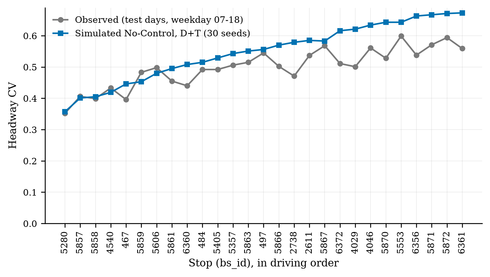
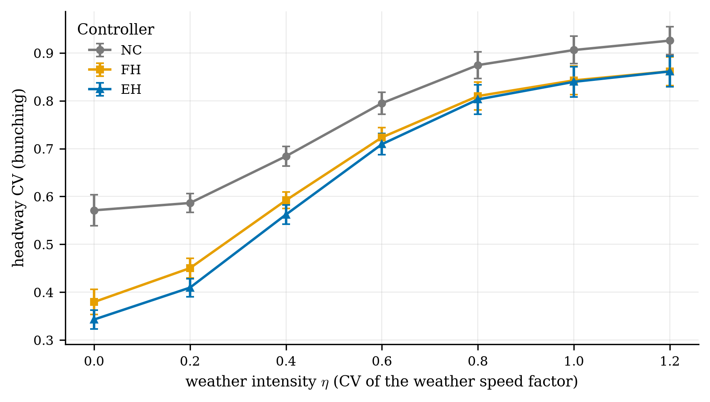

# Week 2 — checking the simulator against reality

**Date:** 2026-09-14 · **Covers:** plan items 5–9 (finishes EO 1.1, feeds EO 1.2); risks R2, R3, R7, R9, R11 ·
**Code:** `starter/scripts/fit_variability.py`, `starter/envs/corridor_sim.py`,
`starter/scripts/build_real_net.py`, `starter/scripts/validate_simulator.py` ·
**Fitted values:** `starter/sim_inputs/fitted/` · **Checks:** `starter/results/validation/`

## 0. Two problems found on the way (both fixed)

1. **Even-Headway never saw the bus behind.** The backward headway `hb` was only measured
   once the follower reached the previous stop. At a 10-minute headway it never had, so
   `hb` was the fallback 600 s in **all 255 of 255** decisions checked. Even-Headway was
   really "half of Forward-Headway", and the MARL agent's backward-headway input was a
   constant. This was in the original code. **Fix:** estimate the follower's arrival from
   its last stop plus the typical running time — what an AVL feed provides (manuscript
   §3, "headways would come from AVL"). `hb` now ranges 257–927 s.
2. **Faster-than-typical traffic draws were ignored.** The simulator lowered a bus's
   maximum speed to slow it, but a bus can never beat the edge speed limit, so every
   "faster" draw did nothing. **Fix:** a SUMO speed factor, which works both ways. SUMO's
   own hidden speed randomness is switched off (`speedDev="0"`).

## 1. Item 5 — variability fitted from data (weekday 07:00–18:00, calibration days)

| Quantity | Before (assumed) | Now (fitted) | How |
|---|---|---|---|
| Dwell time | 6 s + 4 s per boarding | **8.1 s + 5.0 s per boarding + 2.7 s per alighting**, cap 94 s (95th pct) | Weighted fit to the median dwell of each (boardings, alightings) cell, 57,242 events |
| Dwell noise | lognormal CV 0.25 | **log-sd 0.50** | From neighbouring buses (below) |
| Running time per stop pair | all-day median of `rev_seconds − dwell` | **median stop-to-stop time, only when the next record is the next stop** | Removes skipped-stop records (R9); corridor total 4,001 s vs 4,513 s before (−11%) |
| Running-time variation | uniform 0.8–1.2 (log-sd ≈ 0.12) | **per segment, median log-sd 0.20** (0.10–0.35) | From neighbouring buses, dry events only |
| Dispatch (trip start) | perfect, every 600 s | **per-bus sd 165 s** (robust 108 s) | Gaps between neighbours at stop 5280, scaled so the first-stop CV matches the calibration days (0.348) |
| Demand per stop | one all-day mean per recorded stop, fixed count | **weekday 07–18 boardings per trip; count varies day to day (variance = 3.8 × mean)** | Negative binomial; random arrival times (see §5b on per-trip demand) |
| Tech Ridge riders on board | 6.15 (all day, per record) | **6.93** (weekday 07–18, per trip) | |

**Why "from neighbouring buses".** Bunching comes from the difference between one bus and
the next. A late afternoon slows every bus together and does not bunch them. Fitting the
spread of all events (log-sd 0.25 for running time; 280 s for dispatch) made the
simulator bunch too much (No-Control CV 0.89 vs 0.50 observed). So each spread is fitted
from pairs of buses scheduled one headway apart on the same day: spread of the
difference ÷ √2 (27,610 pairs).

**By time of day and day type.** `sim_inputs/fitted/stop_params.csv` holds AM (07–10),
MID (10–15) and PM (15–18) values; `CORRIDOR_PERIOD=AM|MID|PM` runs that period.
Weekday running time: AM 3,846 s, MID 4,008 s, PM 4,218 s. Weekend demand is
recorded in `day_type_summary.csv` (Saturday 110, Sunday 83 vs weekday 141 boardings/hour)
but not simulated, because the 10-minute headway applies to weekdays only.

## 2. Item 6 — bunching, measured the same way

Observed: headway CV per stop per **test** day, weekday 07–18, using only gaps between
buses **scheduled one headway apart** (so a trip that was never recorded does not look
like a 20-minute gap). Simulated: No-Control, ordinary day (D+T), 30 seeds.

| | Observed | Simulated |
|---|---|---|
| First stop (5280) | 0.352 | **0.357** |
| Mean, stops 1–26 | 0.504 | **0.556** (+10%) |
| Stop-by-stop RMSE | — | 0.069 |
| Stop-by-stop correlation | — | 0.87 |
| Loads leaving each stop vs APC `max_load` | — | about 2 riders below, r = 0.99 |
| Share of trips serving each (non-control) stop | 0.64 | **0.69**, r = 0.96 |

Bunching grows along the corridor in both (observed 0.35 → 0.56). The simulator grows a
little faster in the second half (ends at 0.66). The earlier "0.62 observed vs 0.34
simulated" was not like-for-like (different stops, hours and gap definition); on the same
definition the gap is now +0.05. (Numbers above are for the final simulator, after §5b.)

**Proposed SO1 criterion:** No-Control mean headway CV within ±15% of the observed value on
held-out days. Met (+10%).

## 3. Item 7 — calibration tested on unseen days

Weekday service days in date order: 1st, 3rd, 5th … calibrate (65 days); 2nd, 4th …
test (64 days).

| | Calibration days | Test days (never used) |
|---|---|---|
| RMSPE | 0.90% | 3.08% |
| GEH < 5 | 26 / 26 | 26 / 26 (max GEH 0.90) |

The largest test-day error is the shortest segment (2738→2611: 64 s simulated vs 57 s,
+12%). The calibration rule (RMSPE < 2%) is set for fitting; held-out RMSPE is 3.1%.

## 4. Item 8 — ordinary rain effect

Median running time with rain vs without, within the same segment × day type × hour band
(before 07, 07–10, 10–15, 15–18, after 18), in 170 strata with ≥ 10 rain and ≥ 30 dry
events (6,120 rain-exposed runs). Pooled with rain-count weights; 95% CI by resampling
service days.

**Ordinary rain slows running time by 1.35% (95% CI −0.8% to +2.5%) — not significant.**
The earlier pooled 204 s vs 212 s (+4%) was mostly rush-hour timing, as the pipeline's
warning said. In the simulator, W = observed rain multiplier (1.0135) × the labelled
synthetic lognormal stress (η). So the weather layer is now data-based for ordinary rain
and synthetic only for severe weather.

## 5. Item 9 — adjustable disturbance strengths (EO 1.2)

| Disturbance | Model | Strength setting | Default | Source |
|---|---|---|---|---|
| D demand | Negative-binomial counts, random arrivals; dwell noise | fitted | fitted | APC |
| T travel time | Per-segment lognormal running-time factor; dispatch deviation | `traffic_stress_sd` σs (extra, clipped 0.8–1.2) | fitted; σs = 0 | APC; Wang & Sun 2023 Eq. 23 |
| S surge | All boarding demand × f_d, f_d ~ N(1, σd²) clipped to [1, 10] | `surge_sd` σd | 1 (2 and 3 available, not yet run) | Wang & Sun 2023 Eq. 22, p. 9 |
| W weather | Rain multiplier × lognormal (mean 1, CV η), clipped 0.5–3 | `eta` η | 0.8 | APC rain (ordinary); Patil et al. (severe, synthetic) |
| B breakdown | Bus removed at a random stop; riders transfer | `breakdowns` n_B | 1 (check: 3) | Guedes & Borenstein 2018; Daganzo 2009 |
| Holding cap | All controllers | `max_hold` | 120 s (check: 240 s) | Rodriguez et al. 2023; Tang et al. 2024; Wang & Sun 2023; Liu et al. 2023 |

All are arguments of `simulate()` and options of `mc.py` (`--surge-sd`, `--eta`,
`--traffic-sd`, `--breakdowns`, `--max-hold`). The manuscript table
(`methods.tex`, parameter table) was updated to these values.

## 5b. Follow-ups: the four "still soft" items

| Item | What was done | Evidence |
|---|---|---|
| **Stops served on demand** | 80 m before each stop the bus checks: anyone waiting, anyone on board getting off? If neither, it drives past without slowing. First, last and control stops are always served | Stops not always served: served on **69%** of simulated visits vs **64%** of real trips (test days), stop-by-stop **r = 0.96** (`results/validation/stop_service_sim_vs_observed.csv`) |
| **Demand per trip** (found while doing the above) | APC writes a record only when the doors open, so "boardings per record" overstated demand at stops half the buses pass. Demand is now total boardings ÷ trips passing the stop | Corridor boardings 37.5 per trip vs 50.0 per record (−25%) |
| **Skip action** | At a control stop the controller may skip the next stop (only with `skip_enabled=True`): not at the origin, not the last stop, not if the bus ahead skipped it. Riders bound for it are carried on and counted (`riders_overcarried`) | `scripts/test_simulator.py`: 13 checks pass (skip ignored when disabled, refused at origin, never two buses in a row, skipped stop served less, nobody stuck) |
| **Forward-Headway = Daganzo** | hold = d̄ + (α + b)(H0 − h), α = 0.2, d̄ = 25 s (Daganzo's worked example, p. 7), b = boarding rate × 5.0 s per boarding over the stops to the next control stop (his Eq. 3), capped at 120 s | On headway holds 25 s; 5 min early 107 s; 5 min late 0 s |
| **Bunching ~10% high** | Re-checked after the changes above; not tuned | Still 0.556 vs 0.504 (first half matches; stops 15–26 about +0.10). Timepoint holding by real operators could explain it, but the APC schedule field is valid on only 18% of records, so it cannot be shown |

## 6. Baselines re-run on the final simulator

N = 30 paired seeds, 5 control stops, **hold cap 120 s**, one bus removed in B, stops served on
demand, Forward-Headway = Daganzo. `starter/results/mc_summary.md` (headline),
`mc_summary_hold240.md`, `mc_summary_breakdowns3.md`.

| Scenario | NC CV | FH vs NC [95% CI] | EH vs NC [95% CI] |
|---|---|---|---|
| Stage A (D+T, ordinary day) | 0.556 | −29% [−35, −22] | **−38% [−44, −33]** |
| + Surge (S) | 0.596 | −28% [−33, −23] | −38% [−42, −33] |
| + Weather (W) | 0.865 | −8% [−10, −6] | −9% [−11, −7] |
| + Breakdown (B) | 0.564 | −25% [−29, −20] | −34% [−39, −30] |
| **Stage B (all)** | **0.876** | **−8% [−12, −4]** | **−9% [−13, −5]** |

**Checks**

| Scenario | Cap 240 s: FH / EH | 3 buses removed: FH / EH |
|---|---|---|
| Stage A | −30% / −45% | — |
| + Weather | −9% / −12% | — |
| + Breakdown | −26% / −41% | −20% / −28% |
| Stage B | −9% / −12% | −8% / −9% |

**What it means**

1. **Even-Headway beats Daganzo's Forward-Headway on ordinary days** (−38% vs −29%). Even-Headway
   sees both neighbours; Forward-Headway is Daganzo's gentle rule (gain ≈ 0.2–0.3).
2. **Fixed holding works well on an ordinary day and loses most of its effect under severe
   disturbance** (−29/−38% → −8/−9%). Weather drives it.
3. **The cap and the breakdown count do not change the conclusion.** A 240 s cap gives Stage B
   −9/−12%; three removals give −8/−9%.
4. **MARL motivation, on a validated simulator:** rule-based holding recovers only 8–9% of
   bunching under combined severe disturbance (residual CV about 0.80). The SO2 target is the
   gap between that and the ordinary-day −29 to −38%.

## 7. What is still soft

- The simulator bunches about 10% more than real buses, in the second half of the corridor.
- Dispatch spread is scaled to one number (first-stop CV) from 413 neighbour pairs at stop 5280.
- Control stops are always served (so a controller can act); real buses serve them on 47–90% of trips.
- Simulated loads run about 2 riders below APC `max_load`, which is recorded only on door-open
  visits (busier trips); the shape matches (r = 0.99).
- Severe weather and breakdowns remain synthetic by necessity.
